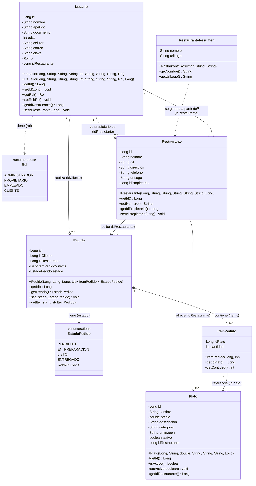
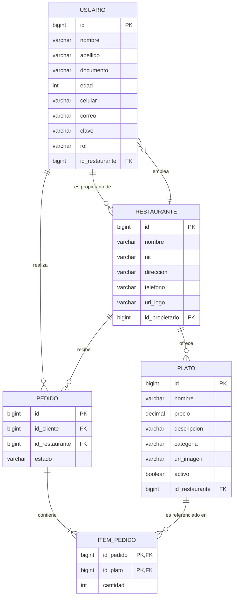
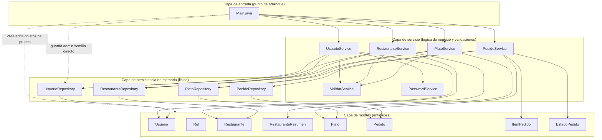

# Diagrama de Clases

```mermaid
classDiagram
    class Usuario {
        -Long id
        -String nombre
        -String apellido
        -String documento
        -int edad
        -String celular
        -String correo
        -String clave
        -Rol rol
        -Long idRestaurante
        +Usuario(Long, String, String, String, int, String, String, String, Rol)
        +Usuario(Long, String, String, String, int, String, String, String, Rol, Long)
        +getId() Long
        +setId(Long) void
        +getRol() Rol
        +setRol(Rol) void
        +getIdRestaurante() Long
        +setIdRestaurante(Long) void
    }

    class Rol {
        <<enumeration>>
        ADMINISTRADOR
        PROPIETARIO
        EMPLEADO
        CLIENTE
    }

    class Restaurante {
        -Long id
        -String nombre
        -String nit
        -String direccion
        -String telefono
        -String urlLogo
        -Long idPropietario
        +Restaurante(Long, String, String, String, String, String, Long)
        +getId() Long
        +getNombre() String
        +getIdPropietario() Long
        +setIdPropietario(Long) void
    }

    class RestauranteResumen {
        -String nombre
        -String urlLogo
        +RestauranteResumen(String, String)
        +getNombre() String
        +getUrlLogo() String
    }

    class Plato {
        -Long id
        -String nombre
        -double precio
        -String descripcion
        -String categoria
        -String urlImagen
        -boolean activo
        -Long idRestaurante
        +Plato(Long, String, double, String, String, String, Long)
        +getId() Long
        +isActivo() boolean
        +setActivo(boolean) void
        +getIdRestaurante() Long
    }

    class EstadoPedido {
        <<enumeration>>
        PENDIENTE
        EN_PREPARACION
        LISTO
        ENTREGADO
        CANCELADO
    }

    class ItemPedido {
        -Long idPlato
        -int cantidad
        +ItemPedido(Long, int)
        +getIdPlato() Long
        +getCantidad() int
    }

    class Pedido {
        -Long id
        -Long idCliente
        -Long idRestaurante
        -List~ItemPedido~ items
        -EstadoPedido estado
        +Pedido(Long, Long, Long, List~ItemPedido~, EstadoPedido)
        +getId() Long
        +getEstado() EstadoPedido
        +setEstado(EstadoPedido) void
        +getItems() List~ItemPedido~
    }

    Usuario "1" --> "0..*" Restaurante : es propietario de (idPropietario)
    Restaurante "1" --> "0..*" Usuario : tiene empleados (idRestaurante)
    Usuario "1" --> "0..*" Pedido : realiza (idCliente)
    Restaurante "1" --> "0..*" Pedido : recibe (idRestaurante)
    Restaurante "1" --> "0..*" Plato : ofrece (idRestaurante)
    Pedido "1" *-- "1..*" ItemPedido : contiene (items)
    ItemPedido "1" --> "1" Plato : referencia (idPlato)
    Usuario ..> Rol : tiene (rol)
    Pedido ..> EstadoPedido : tiene (estado)
    RestauranteResumen ..> Restaurante : se genera a partir de
```

# Modelo Relacional

```mermaid
erDiagram
    USUARIO {
        bigint id PK
        varchar nombre
        varchar apellido
        varchar documento
        int edad
        varchar celular
        varchar correo
        varchar clave
        varchar rol
        bigint id_restaurante FK
    }

    RESTAURANTE {
        bigint id PK
        varchar nombre
        varchar nit
        varchar direccion
        varchar telefono
        varchar url_logo
        bigint id_propietario FK
    }

    PLATO {
        bigint id PK
        varchar nombre
        decimal precio
        varchar descripcion
        varchar categoria
        varchar url_imagen
        boolean activo
        bigint id_restaurante FK
    }

    PEDIDO {
        bigint id PK
        bigint id_cliente FK
        bigint id_restaurante FK
        varchar estado
    }

    ITEM_PEDIDO {
        bigint id_pedido PK, FK
        bigint id_plato PK, FK
        int cantidad
    }

    USUARIO ||--o{ RESTAURANTE : "es propietario de"
    RESTAURANTE ||--o{ USUARIO : "emplea"
    USUARIO ||--o{ PEDIDO : "realiza"
    RESTAURANTE ||--o{ PEDIDO : "recibe"
    RESTAURANTE ||--o{ PLATO : "ofrece"
    PEDIDO ||--|{ ITEM_PEDIDO : "contiene"
    PLATO ||--o{ ITEM_PEDIDO : "es referenciado en"
```

# Diagrama de Arquitectura

```mermaid
flowchart TD
    subgraph MAIN["Capa de entrada (punto de arranque)"]
        Main["Main.java"]
    end

    subgraph SERVICE["Capa de servicio (logica de negocio y validaciones)"]
        UsuarioService["UsuarioService"]
        RestauranteService["RestauranteService"]
        PlatoService["PlatoService"]
        PedidoService["PedidoService"]
        ValidarService["ValidarService"]
        PasswordService["PasswordService"]
    end

    subgraph REPOSITORY["Capa de persistencia en memoria (listas)"]
        UsuarioRepository["UsuarioRepository"]
        RestauranteRepository["RestauranteRepository"]
        PlatoRepository["PlatoRepository"]
        PedidoRepository["PedidoRepository"]
    end

    subgraph MODEL["Capa de modelo (entidades)"]
        Usuario["Usuario"]
        Rol["Rol"]
        Restaurante["Restaurante"]
        RestauranteResumen["RestauranteResumen"]
        Plato["Plato"]
        Pedido["Pedido"]
        ItemPedido["ItemPedido"]
        EstadoPedido["EstadoPedido"]
    end

    Main --> UsuarioService
    Main --> RestauranteService
    Main --> PlatoService
    Main --> PedidoService
    Main -.->|"guarda admin semilla directo"| UsuarioRepository
    Main -.->|"crea/edita objetos de prueba"| MODEL

    UsuarioService --> UsuarioRepository
    UsuarioService --> RestauranteRepository
    UsuarioService --> ValidarService
    UsuarioService --> PasswordService
    UsuarioService --> Usuario

    RestauranteService --> RestauranteRepository
    RestauranteService --> UsuarioRepository
    RestauranteService --> ValidarService
    RestauranteService --> Restaurante
    RestauranteService --> RestauranteResumen

    PlatoService --> PlatoRepository
    PlatoService --> RestauranteRepository
    PlatoService --> ValidarService
    PlatoService --> Plato

    PedidoService --> PedidoRepository
    PedidoService --> PlatoRepository
    PedidoService --> Pedido
    PedidoService --> ItemPedido
    PedidoService --> EstadoPedido

    UsuarioRepository --> Usuario
    RestauranteRepository --> Restaurante
    PlatoRepository --> Plato
    PedidoRepository --> Pedido
```
